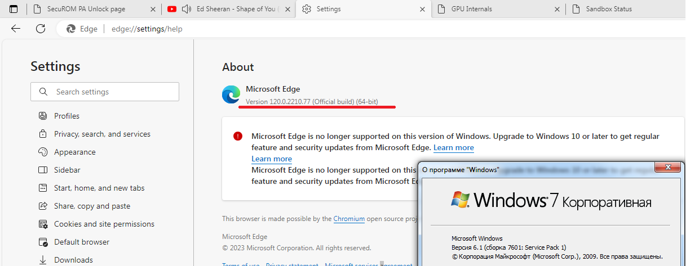
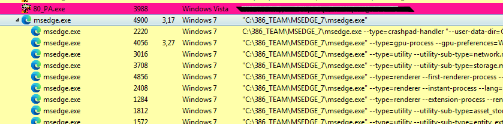

# Microsoft-EDGE-Windows-7-CRACK
## 120.0.2210.77_x64    120.0.2210.91_x86
`--no-sandbox`**is no longer needed! Exception:** for temporary printing operations (Ctrl + P/ Ctrl + Shift + P)

 
* see *!!!!!!!README_FIRST!.pdf*
  

## Intro  
Dirty corporations and Hindu-managers are trying to deprive the any users of all the benefits that were created by technically more advanced people than them. Windows 7 and Windows XP are the most successful and best technical creations of Microsoft ever.  

## Chromium based projects
🌈 [Google Chrome](https://github.com/Blaukovitch/GOOGLE_CHROME_Windows_7_CRACK/) **PRIMARY** branch  
🅾️ [Opera 102.0.4880.70](https://github.com/Blaukovitch/GOOGLE_CHROME_Windows_7_CRACK/releases/tag/Opera_EARLY/) browser   
🦁 [BRAVE 120.1.61.120](https://github.com/Blaukovitch/GOOGLE_CHROME_Windows_7_CRACK/releases/tag/brave) browser  
🟢 [Spotify 1.2.22.982](https://github.com/Blaukovitch/GOOGLE_CHROME_Windows_7_CRACK/releases/tag/Spotify_first) music
  
## How it's work?  
1) **Binary bithack (patch the assembly code):**  
* msedge.exe  
* *{ver.}*/msedge_elf.dll  
* *{ver.}*/msedge.dll
* *{ver.}*/msedgewebview2.exe
* *{ver.}*/telclient.dll
* *{ver.}*/mojo_core.dll
* *{ver.}*/EBWebView/x64(x86)/EmbeddedBrowserWebView.dll   
and some services .exe/.dll

2) **WinAPI LIFTING - Missing WINAPIs are deployed:**  
* API-MS-WIN-SHCORE-SCALING-L1-1-1  
* API-MS-WIN-POWER-BASE-L1-1-0  
* API-MS-WIN-CORE-WINRT-STRING-L1-1-0  
* API-MS-WIN-CORE-WINRT-L1-1-0  
* API-MS-WIN-CORE-WINRT-ERROR-L1-1-0
* API-MS-WIN-CORE-REALTIME-L1-1-1
* API-MS-WIN-CORE-LIBRARYLOADER-L1-2-0
* API-MS-WIN-CORE-HANDLE-L1-1-0
3) **Bridged DLL (wrappers):** 
* kernel64.dll
* user64.dll
* userenx.dll
* xcryptprimitives.dll
* Xfplat.dll
* WinXttp.dll
* netapi64.dll
* wldp.dll  
https://github.com/Blaukovitch/API-MS-WIN_XP 

⚠️ <u>WARNING:</u> Files not signed! I don't have a Google Inc. private key at the moment.

## How to install?
1) Download from release the merged pack; 

## WOW! WebGPU on Windows 7
May be unstable!  
Add to command line (with *--no-sandbox*) webgpu flag and **DirectX 3D 11** as webgpu render:  
`--enable-unsafe-webgpu --use-webgpu-adapter=d3d11`  
In launched Chrome/MSEDGE must set enabled those flags:  
`chrome://flags/#enable-webgpu-developer-features`  
`chrome://flags/#ignore-gpu-blocklist`  
and restart again.  

## Features table
| Critical | State |
| ------ | ------ |
| Stable | ✔️ |
| WinAPI lifting | approx. **95%** |
| Sandbox support (print/PDF view) | ✔️/❌ | 
| DirectX Write render | ✔️ | 
| DXVAVDA | ✔️ | 
| WebGL1/2 | ✔️ | 
| WebGPU / DirectX 11 (gpu)| ❓ | 

## YOUTUBE
https://www.youtube.com/watch?v=idzQV2wNUAI

**ELF (author of 80_PA SecuROM keygen), cracklab/exelab team, 2023**  
https://cracklab.team/index.php?threads/1037/
